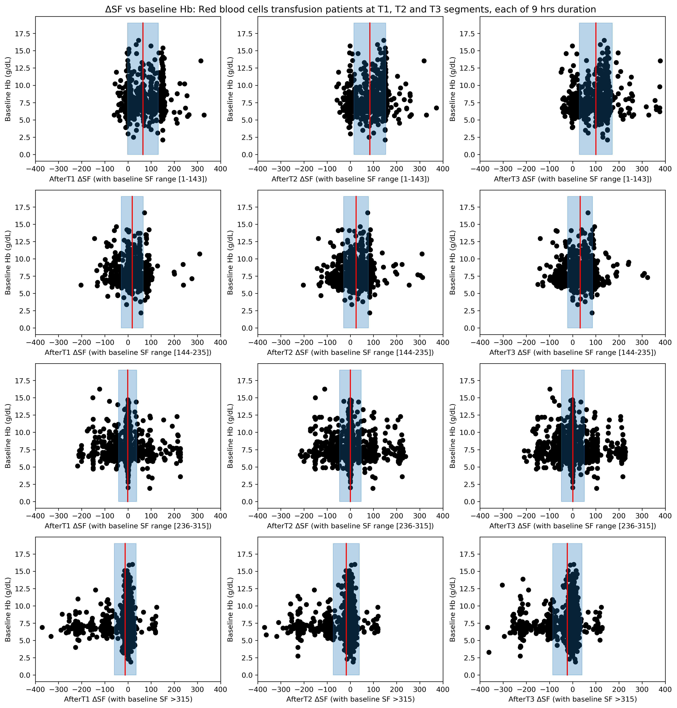
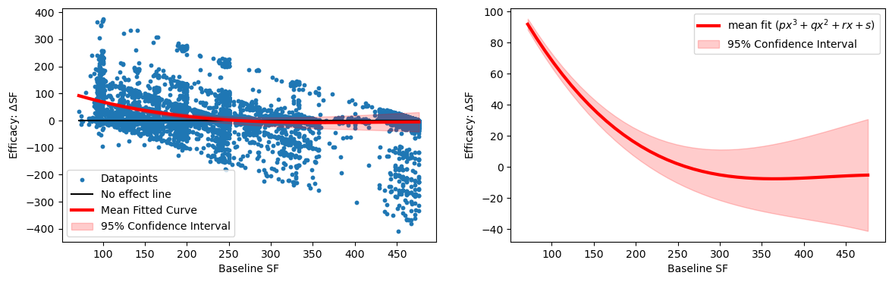
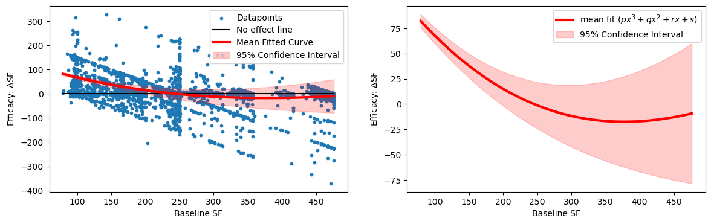

# transfusionEfficacy 

It contains all the data and five python notebook files for cohort selection, feature extraction, and analysis on hospital sites: Emory University Hospital (as derivation) and Grady Memorial Hospital (as validation). 

- Derivation study notebooks: (a) [All_EMORYpatients_transfusion_ver3.ipynb](./All_EMORYpatients_transfusion_ver3.ipynb), (b) [Relation_EMORY_Hb_delSF_delHb_ver3_rev1.ipynb](./Relation_EMORY_Hb_delSF_delHb_ver3_rev1.ipynb)

- Validation study notebooks: (c) [All_GRADYpatients_transfusion_ver3.ipynb](./All_GRADYpatients_transfusion_ver3.ipynb), (d) [Relation_GRADY_Hb_delSF_delHb_ver3_rev1.ipynb](./Relation_GRADY_Hb_delSF_delHb_ver3_rev1.ipynb)

- Generation of characteristic tables: (e) [TableOneGeneration_emory_grady.ipynb](./TableOneGeneration_emory_grady.ipynb)

- Results data can be found under this folder: [DATA_RESULTS_REV1](./DATA_RESULTS_REV1)

## RBC Transfusion Efficacy Marker

In this study, we introduced $SpO_2/FiO_2$ (SF) ratio as a more suitable metric for evaluating RBC transfusion effectiveness in non-traumatic ICU patients with respiratory physiologic derangements. The SF ratio could be used along with hemoglobin for a better assessment. ΔSF measures the RBC transfusion efficacy.

### Figure: Baseline Hb vs ΔSF for derivation data
Derivation data: Localized study on patients having different ranges of baseline SF ratios. ΔSF vs baseline Hb for three consecutive post-transfusion regions (each of duration 9 hours) with baseline SF range [row-1] 1-143, [row-2] 144-235, [row-3] 236-315, and [row-4] >315. Note that data-points denote the distribution of patients. Red vertical line with blueish filled region around it represents the mean ± standard deviation of the SF difference.

### Figure: Baseline Hb vs ΔSF for validation data
Validation data: Localized study on patients having different ranges of baseline SF ratios. ΔSF vs baseline Hb for three consecutive post-transfusion regions (each of duration 9 hours) with baseline SF range [row-1] 1-143, [row-2] 144-235, [row-3] 236-315, and [row-4] >315. Note that data-points denote the distribution of patients. Red vertical line with blueish filled region around it represents the mean ± standard deviation of the SF difference.

### Figure: Transfusion efficacy trend with different baseline SFs for derivation data
The following figure shows a relationship between baseline SF (BSF) and transfusion efficacy (ΔSF). Resultant mean curve (solid red) and its 95% confidence interval (shaded red region) modelled with a cubic-polynomial curve fitting demonstrates an inverse relationship of BSF and ΔSF. Modeling parameters of mean fitted curve are as follows: -0.000002, 0.0031, -1.28, 168.5.

### Figure: Transfusion efficacy trend with different baseline SFs for validation data
The following figure shows a relationship between baseline SF (BSF) and transfusion efficacy (ΔSF). Resultant mean curve (solid red) and its 95% confidence interval (shaded red region) modelled with a cubic-polynomial curve fitting demonstrates an inverse relationship of BSF and ΔSF. Modeling parameters of mean fitted curve are as follows: -0.0000008, 0.0018, -1.007, 151.81.

