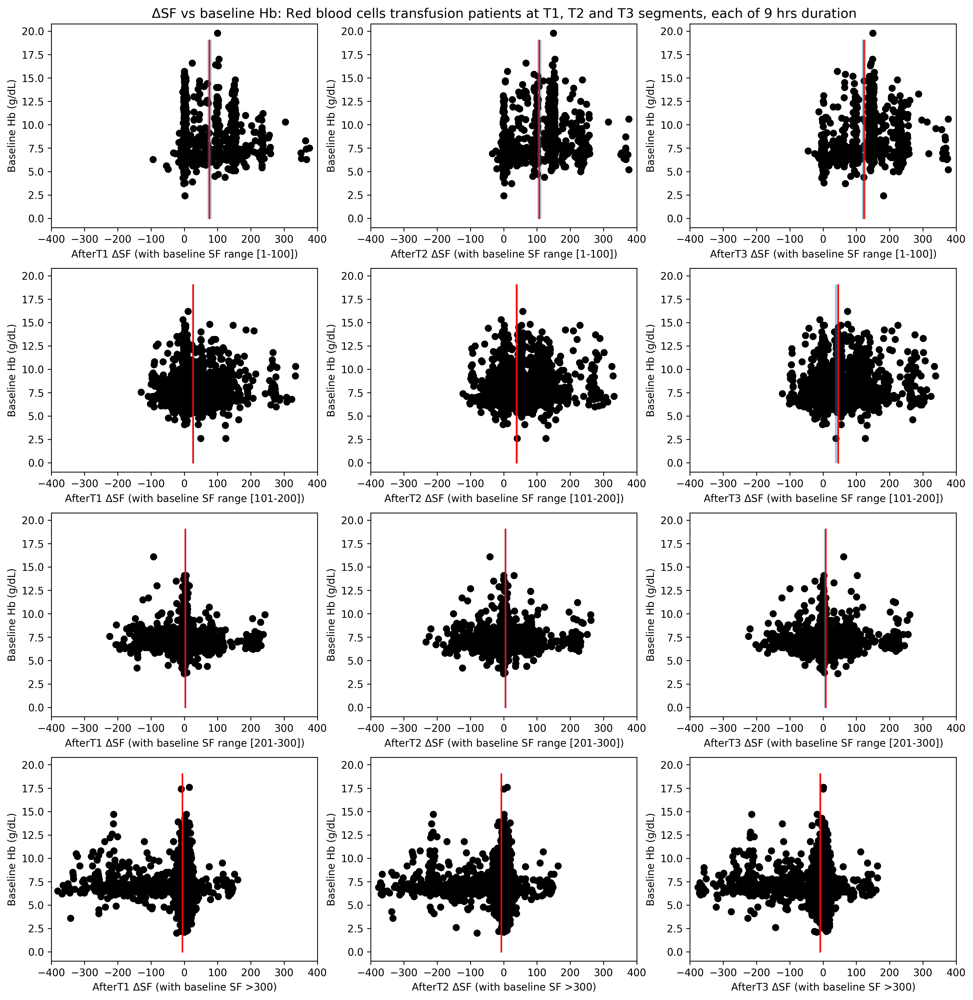
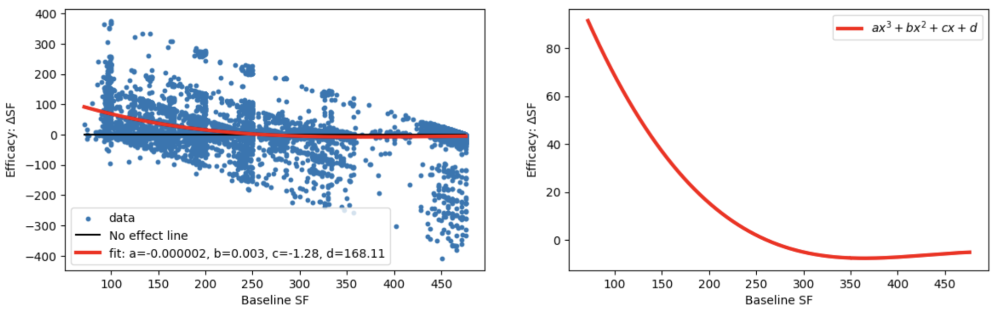

# transfusionEfficacy

It contains four python notebook files for cohort selection, feature extraction, and analysis on Emory and Grady hospital sites.

## RBC Transfusion Efficacy Marker

In this study, we introduced $SpO_2/FiO_2$ (SF) ratio as a more suitable metric for evaluating RBC transfusion effectiveness in non-traumatic ICU patients with respiratory physiologic derangements.

### Figure: Baseline Hb vs del SF

### Figure: Transfusion efficacy trend with different baseline SFs

